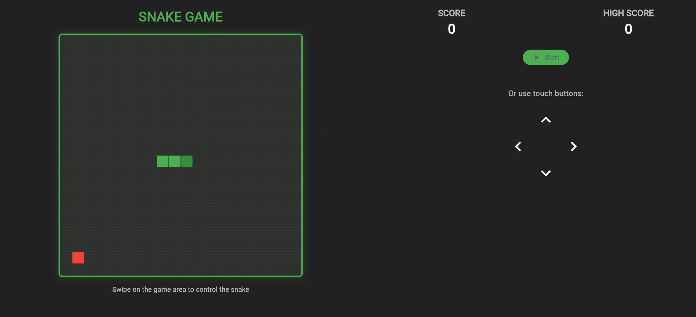
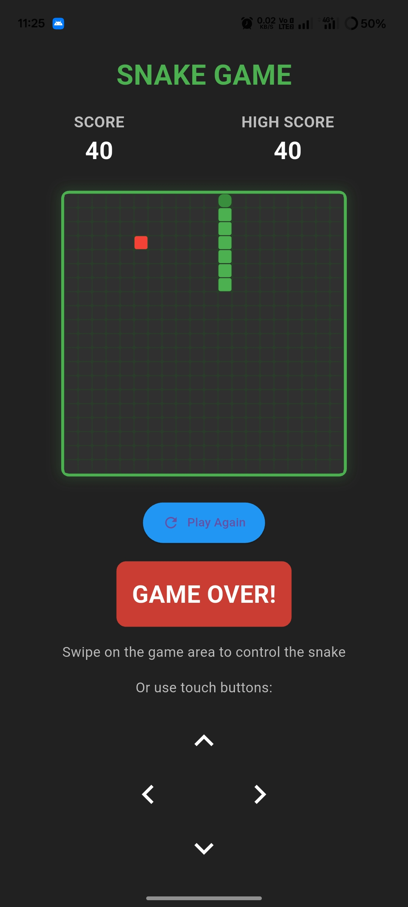

  
# 🐍 Snake Game (Flutter)      

A modern take on the classic **Snake Game**, built entirely with **Flutter** and **Dart**.
The snake grows as it eats food, but avoid colliding with the walls or yourself — or it’s game over! 🎮
  
 
---

## 🎯 Features

✅ Start, Pause, Resume, and Play Again options
✅ Swipe controls **and** touch button controls
✅ Dynamic **score & high score** tracking
✅ Clean **portrait & landscape** responsive layout
✅ Retro-style **Game Over screen**
✅ Intro **logo splash popup** before gameplay. 
 
 
---

## 🛠️ Tech Stack

* **Flutter** (UI & cross-platform framework)
* **Dart** (game logic & state management)
* **Material Design 3**

---

## 📂 Project Structure

```
lib/
│── main.dart        # Main entry & UI
│── snake.dart       # Snake model (inside main for now)
│── food.dart        # Food logic (inside main for now)
assets/
│── images/snake_logo.jpg  # Logo image shown on intro popup
pubspec.yaml
```

---

## 🎮 How to Play

1. Run the app on an Android/iOS device or emulator.
2. **Swipe** on the game board or use the **arrow touch buttons** to move.

   * ⬆️ Up
   * ⬇️ Down
   * ⬅️ Left
   * ➡️ Right
3. Eat red food 🍎 to grow and increase your score.
4. Don’t hit the walls or your own body — or it’s **Game Over**.

---

## 🚀 Getting Started

1. Clone this repo:

   ```bash
   git clone https://github.com/your-username/snake-game-mobile-app.git
   cd snake-game-mobile-app
   ```
   

2. Install dependencies:

   ```bash
   flutter pub get
   ```

3. Run on emulator/device:

   ```bash
   flutter run
   ```

---

## 📸 Screenshots
<h1>Desktop View</h1>

<hr>
<h1>Mobile View</h1>



---

## 📌 Future Improvements

* 🎵 Add background music & sound effects
* 🎨 Skins for snake and food
* 🏆 Leaderboard system (Firebase integration)
* 📱 Multiplayer mode

